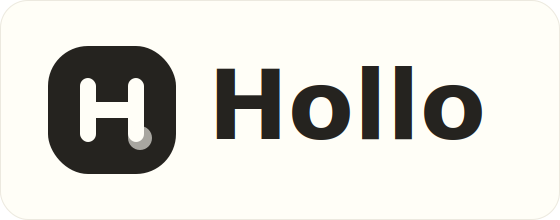
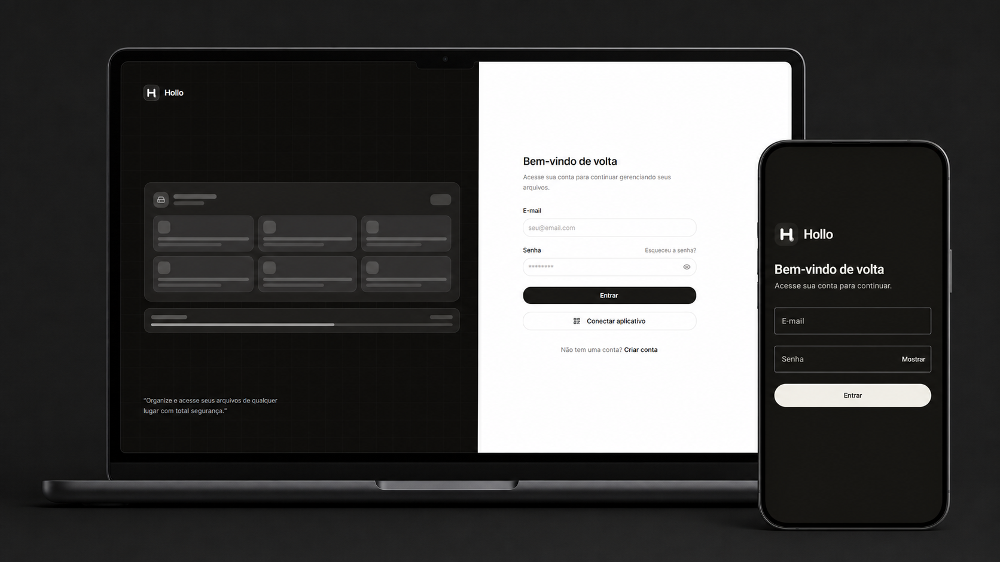

<p align="center">
  
</p>

<p align="center">
  Seu drive local, acessível no computador e no celular.
</p>

<p align="center">
  
</p>

# Hollo

Hollo é um drive local para armazenar, organizar e administrar arquivos em um computador, rede interna ou servidor doméstico. A interface web cuida da gestão completa e o aplicativo Android permite acessar o mesmo servidor pela rede local.

O projeto roda como uma stack autocontida com frontend React, backend ASP.NET Core, PostgreSQL e armazenamento compatível com Azure Blob via Azurite. Aplicativo e servidor são pareados por QR Code, sem gravar o IP permanentemente no APK.

## Plataformas

- Web responsiva para arquivos, pastas, usuários e administração.
- Aplicativo Android nativo com Jetpack Compose.
- Servidor local em Docker Compose para Windows ou Linux.
- Pareamento do aplicativo por QR Code.
- Uploads e downloads autenticados pela API, sem exposição direta do Azurite.

## Status

Projeto em fase de MVP.

Ja existe:

- Cadastro, login, logout e usuario administrador padrao.
- Gerenciador de arquivos no frontend.
- Criacao e navegacao de pastas.
- Upload e download de arquivos.
- Favoritos.
- Lixeira com mover e restaurar.
- Calculo de uso de armazenamento e quota por usuario.
- Painel administrativo para listar, desativar, reativar e apagar acesso de usuarios.
- Docker Compose com frontend, backend, PostgreSQL e Azurite.
- Aplicativo Android com login, navegação, upload, criação de pastas e lixeira.
- Pareamento entre aplicativo e servidor por QR Code.

Ainda vale acompanhar o backlog em [MVP_DRIVE_LOCAL.md](MVP_DRIVE_LOCAL.md).

## Stack

- Frontend: React, React Router, TypeScript, Tailwind CSS, shadcn/ui.
- Backend: ASP.NET Core, C#, Entity Framework Core.
- Banco: PostgreSQL.
- Storage: Azurite em desenvolvimento local, usando API de Azure Blob Storage.
- App mobile: Android nativo, Kotlin e Jetpack Compose.

## Estrutura

```text
.
|-- backend/              # API ASP.NET Core
|-- frontend/             # Frontend web React
|-- app/                  # Aplicativo Android em Kotlin/Compose
|-- installer/windows/    # Setup de rede e inicialização sem elevação
|-- installer/linux/      # Setup, atualização e backup para Linux
|-- infra/avahi/          # Descoberta mDNS opcional para Linux
|-- docs/assets/          # Imagens e mockups da documentação
|-- docker-compose.yml    # Stack local completa
|-- MVP_DRIVE_LOCAL.md    # Escopo e pendencias do MVP
`-- README.md
```

## Requisitos

Para rodar com Docker:

- Docker
- Docker Compose

Para desenvolvimento fora do Docker:

- .NET SDK 10
- Node.js 22+
- PostgreSQL
- Azurite ou outro endpoint compativel com Azure Blob Storage

## Rodando com Docker Compose

Na raiz do projeto:

```bash
docker compose up --build
```

Servicos expostos:

| Servico | URL |
| --- | --- |
| Frontend | http://localhost:5173 |
| Backend API | http://localhost:8080 |
| Swagger | http://localhost:8080/swagger |
| Health check | http://localhost:8080/health |
| PostgreSQL | interno à rede Docker |
| Azurite Blob | interno à rede Docker |

Credencial inicial:

```text
E-mail: admin@hollo.local
Senha: Admin@123456
```

> Troque a senha e as chaves antes de usar fora de ambiente local.

## Dados locais

O Docker Compose cria volumes persistentes:

- `postgres_data`: dados do PostgreSQL.
- `azurite_data`: blobs enviados para o storage local.

Os arquivos enviados ficam no Azurite, e as informacoes de usuarios, pastas e metadados ficam no PostgreSQL.

Para remover containers mantendo os dados:

```bash
docker compose down
```

Para remover containers e apagar tambem os volumes:

```bash
docker compose down -v
```

## Backup

Backup do banco:

```bash
docker compose exec postgres pg_dump -U postgres -d hollo > hollo-postgres-backup.sql
```

Para o storage, exporte o volume `azurite_data`. O nome real pode variar conforme o nome do diretorio do projeto. Confira com:

```bash
docker volume ls
```

Em uma instalacao padrao neste diretorio, o volume costuma ser `hollo_azurite_data`.

## Configuracao

As principais variaveis usadas pelo backend no Docker Compose sao:

| Variavel | Uso |
| --- | --- |
| `ConnectionStrings__DefaultConnection` | Conexao PostgreSQL |
| `AzureBlobStorage__AccountName` | Conta do Azurite/Azure Blob |
| `AzureBlobStorage__AccountKey` | Chave da conta de storage |
| `AzureBlobStorage__ContainerName` | Container onde os arquivos ficam |
| `AzureBlobStorage__BlobServiceUri` | Endpoint interno usado pelo backend |
| `AzureBlobStorage__PublicBlobServiceUri` | Endpoint acessivel pelo navegador |
| `AzureBlobStorage__MaxUploadSizeInBytes` | Tamanho maximo de upload |
| `StorageQuota__DefaultUserQuotaInBytes` | Quota padrao por usuario |
| `TrashCleanup__RetentionDays` | Retencao de itens na lixeira |
| `Auth__SigningKey` | Chave de assinatura dos tokens |
| `AdminUser__Email` | E-mail do admin inicial |
| `AdminUser__Password` | Senha do admin inicial |

O backend aplica migrations automaticamente ao iniciar.

## Desenvolvimento local

### Backend

```bash
cd backend
dotnet restore
dotnet run
```

O backend precisa de PostgreSQL e storage configurados. Com Docker, essas configuracoes ja estao no `docker-compose.yml`.

### Frontend

```bash
cd frontend
npm install
npm run dev
```

Por padrao, o Vite encaminha chamadas `/api` para `http://localhost:8080`. Para mudar:

```bash
VITE_API_PROXY_TARGET=http://localhost:8080 npm run dev
```

No PowerShell:

```powershell
$env:VITE_API_PROXY_TARGET = "http://localhost:8080"
npm run dev
```

### Aplicativo Android

```bash
cd app
./gradlew :app:assembleDebug
```

No Windows, use `gradlew.bat :app:assembleDebug`. O APK de desenvolvimento é
gerado em `app/app/build/outputs/apk/debug/app-debug.apk`.

## Rotas principais da API

| Metodo | Rota | Descricao |
| --- | --- | --- |
| `POST` | `/api/auth/register` | Cadastro |
| `POST` | `/api/auth/login` | Login |
| `POST` | `/api/auth/logout` | Logout |
| `GET` | `/api/auth/me` | Usuario autenticado |
| `GET` | `/api/files/browser` | Listagem de diretorio |
| `POST` | `/api/files/folders` | Criar pasta |
| `POST` | `/api/files/upload` | Enviar arquivo pela API |
| `GET` | `/api/files/{id}/content` | Baixar arquivo pela API |
| `PATCH` | `/api/files/{id}/trash` | Mover arquivo para lixeira |
| `PATCH` | `/api/files/folders/{id}/trash` | Mover pasta para lixeira |
| `PATCH` | `/api/files/{id}/restore` | Restaurar arquivo |
| `PATCH` | `/api/files/folders/{id}/restore` | Restaurar pasta |
| `GET` | `/api/admin/users` | Listar usuarios como admin |
| `GET` | `/api/server/pairing` | Dados de pareamento do servidor |

Veja a documentacao interativa em `http://localhost:8080/swagger` com o backend em modo Development.

## Troubleshooting

## Descoberta automática na rede local

Em um host Linux, inicie o Hollo com o perfil de descoberta para anunciar
`hollo.local` e o serviço `_hollo._tcp.local` via mDNS:

```bash
docker compose --profile discovery up --build -d
```

Verifique o anúncio a partir de outra máquina Linux com Avahi instalado:

```bash
avahi-browse -rt _hollo._tcp
```

O serviço `avahi` usa `network_mode: host`, necessário para publicar multicast
na rede física. Esse perfil é destinado a Docker Engine em Linux; no Docker
Desktop para Windows ou macOS, a máquina virtual pode impedir que o multicast
chegue à rede local. O firewall do host ainda deve permitir UDP `5353` para
mDNS e TCP `8080` para a API, restritos à rede local.

## Setup no Windows e pareamento por QR Code

Abra o PowerShell como administrador e execute:

```powershell
.\installer\windows\install-hollo.ps1
```

O script administrativo detecta o IPv4 da interface ativa, cria o `.env` com
a URL pública, gera uma identidade para o servidor e libera TCP `8080` somente
para `LocalSubnet`. Ele não inicia o Docker nem executa containers.

Feche o PowerShell administrativo, abra um PowerShell comum e execute:

```powershell
.\installer\windows\start-hollo.ps1
```

Esse segundo script reconstrói e inicia os containers sem elevação. Na tela de login web, selecione
`Conectar aplicativo` e escaneie o QR Code pelo ícone no topo do app Android.

Para remover apenas a regra de firewall:

```powershell
.\installer\windows\remove-hollo-firewall.ps1
```

Atualização e backup, sempre em PowerShell comum:

```powershell
.\installer\windows\update-hollo.ps1
.\installer\windows\backup-hollo.ps1
```

## Setup no Linux

Em Debian, Ubuntu e distribuições semelhantes, execute a configuração de rede
uma única vez com privilégios administrativos:

```bash
sudo bash installer/linux/install-hollo.sh
```

Depois, use Docker sem `sudo`:

```bash
bash installer/linux/start-hollo.sh
```

Para atualizar e criar backup:

```bash
bash installer/linux/update-hollo.sh
bash installer/linux/backup-hollo.sh
```

O instalador detecta o IPv4 e a sub-rede local, preserva a identidade do
servidor e configura UFW ou firewalld quando um deles estiver ativo. O Docker
não é iniciado pela etapa administrativa.

Se o frontend nao conseguir chamar a API:

- Confirme se o backend esta em `http://localhost:8080`.
- Confirme se `VITE_API_PROXY_TARGET` aponta para o backend correto.
- Reinicie o container `frontend` depois de alterar variaveis.

Se o login do admin nao funcionar:

- Confira `AdminUser__Email` e `AdminUser__Password` no `docker-compose.yml`.
- Se o usuario ja foi criado antes, alterar a variavel nao muda automaticamente a senha existente.

Se uploads falharem:

- Confirme se o container `azurite` esta rodando.
- Confirme se o backend consegue acessar `http://azurite:10000/hollo` na rede Docker.
- Confira a quota em `StorageQuota__DefaultUserQuotaInBytes`.

Se o banco nao conectar:

- Confirme se o container `postgres` esta healthy.
- Veja os logs com `docker compose logs postgres`.

## Licenca

Defina a licenca antes de distribuir o projeto.
